converting the diagram to text

https://services.w3.org/xslt?transform=Submit&xmlfile=https%3A%2F%2Fraw.githubusercontent.com%2Fmeta-introspector%2Fsolfunmeme%2Frefs%2Fheads%2Fdiagram%2Fsolfunmeme_Untitled-2025-02-15-1453.svg&xslfile=http%3A%2F%2Fwww.w3.org%2F2002%2F05%2Fsvg2text.xsl

```
linux AI ZKML DEPT COMPLIANCE TO AUDIT $SOLFUNMEME Linux https://www.solfunmeme.com/ Goals Core_Services Deployment_Infrastructure Server_Environment Streaming_Setup Development_Environment OBS Studio Chocolatey Package Manager VS Code Git Tiger VNC terraform aws cli v2 Restream Telegram Twitter Discord Bot SSH Connection Tmux Multiplexer Emacs Docker Container CloudFormation Terraform AWS Services Eliza Service Twitter Spaces Discord Service Solana Integration Document Multi-Cloud (AWS) Setup Parameter Management Infrastructure Verification https://codeberg.org/introspector/meta-meme/issues/56 Real_World_Implementation Token_System Technical_Stack Theoretical_Foundation Zero Ontology System Zero Knowledge Proofs Homotopy Type Theory Coq Language MetaCoq Haskell Implementation GCC Compiler ZOST1 NFT Token SOLFUNMEME Token Meta-Meme System Regulatory Compliance Job Creation ZK Applications 2024 - Unimath https://github.com/meta-introspector/unimath-comic UU Universe of Universes elements of component of domain of scombinator domain and codomain of U - universe of universes +Type��� +�� (��������� ��� Type���) �� A ��� ��� n ��� isSet(A n) El -ement +U ��� Type��� Muse +Type��� +�� U El Vector +Muse ��� Type��� MetaMeme +Muse ��� Muse ��� Type��� creates implements uses ��interface�� Loop MetaMeme(M, M) idLoop +idLoop(M: Muse) : Loop PUMP AWS AWSCLI TERRAFORM GIT https://github.com/ jmikedupont2/ai-agent-terraform/ branch: feature/np-introspector directory : accounts/mdupont/ Terraform INIT Region: us-east-2 aws- account- number: 12345 agent- name: Terraform Apply aws plugin profile name : default aws acount aws iam user admin user aws access key ssh key (optional) ~/.aws/credentials aws config log bucket Package Management npm Nix Guix Traditional Docker Image Nix-based Docker Image Guix-based Docker Image Docker Image Composition Final Docker Image Docker Host Docker Compose Volume Container 1 Container 2 Container N data/container1 data/container2 data/containerN Shared Volume Mount Mount Mount Subdir Subdir Subdir Start Multiple Repositories? Iterate Over Repositories Single Repository Workflow Setup GitHub Actions Checkout Repository Code Set Up Docker Build Docker Image Push to Docker Registry? Login to Docker Registry Push Docker Image Skip Push Deploy or Use Image Complete Yes No Yes No private user data parameter installer llm apps seed spore image boot asg lt docker ec2 hub codebuild ecr threads SystemD Docker Container Node Eliza PlUGINS process cpu arm64 memory ENV 2gb ram 30g disk encrypted kms file system resources providers terrafom cloudforamtion native aws 2025 grant on prem azure gcp user gui self introspector metameme meme expression semiosis fitness function phone mouse pen paper hand drawing hippocampus procedure petals/ directions neurons/hypeas reconfig restart deploy configure test bootstrap collect ssm parameters documents logs procedure iso9000 dashboard vercel wordpress github repo actions t4g.small public SEEd Eliza PlUGINS character character.json git commit branch wallet SSO gmail cognito t3.micro 1gb ram LLC country state makerspace pc recycle county city grant training youth open streetmap wikipedia yelp traffic construction NJ MA ZKP ZKML MODEL Procedures Followed HIDDEN COMPRESS Quality Metrics Necessary Type Safty character Oracle spectral decomposition type MetaMeme Coin https://github.com/meta- introspector/meta-meme/issues/160 Unimath meta-meme Lang Agent Mina coins mina eliza image https://hub.docker.com/repo sitory/docker/h4ckermike/eli zaos-eliza/general groq nivdia 5000 openrouter openai bedrock LLM ollama litellm/openlightllm petals.dev
```

Constructing a semantic graph involves representing entities (nodes) and their relationships (edges) in a structured way to capture meaning and context. Given the extensive list of terms and phrases you’ve provided, I’ll interpret your request as asking for a semantic graph that ties together the key concepts related to a Linux-based AI system with Zero-Knowledge Machine Learning (ZKML), compliance auditing, and the $SOLFUNMEME token/project (as referenced by https://www.solfunmeme.com/). The graph will focus on goals, core services, deployment infrastructure, development environment, and theoretical foundations, while incorporating tools, technologies, and systems you’ve mentioned.
Since this is a text-based response, I’ll describe the semantic graph in a structured format (nodes and edges) that you could visualize using a tool like Graphviz, Neo4j, or a custom diagramming library. I’ll prioritize clarity and relevance, grouping related concepts and omitting redundant or unclear terms (e.g., partial code fragments or ambiguous notations) unless they directly inform the graph’s purpose.
Semantic Graph: Linux AI ZKML Dept Compliance to Audit $SOLFUNMEME

```
Nodes (Entities)
Linux - Operating system foundation.
AI - Artificial intelligence systems and applications.
ZKML (Zero-Knowledge Machine Learning) - Privacy-preserving ML with zero-knowledge proofs.
Dept_Compliance - Department or system for regulatory compliance.
Audit - Process to verify compliance and system integrity.
$SOLFUNMEME - Token/project tied to Solana blockchain (https://www.solfunmeme.com/).
Goals - Objectives of the system (e.g., privacy, compliance, deployment).
Core_Services - Primary functionalities (e.g., Eliza service, Discord bot).
Deployment_Infrastructure - Systems for deploying services (e.g., AWS, Docker).
Server_Environment - Server setup (e.g., AWS EC2, Tmux).
Streaming_Setup - Tools for streaming (e.g., OBS Studio, Restream).
Development_Environment - Tools for coding/development (e.g., VS Code, Git).
Solana_Integration - Blockchain integration with Solana.
Multi-Cloud_AWS_Setup - AWS-based multi-cloud infrastructure.
Zero_Ontology_System - Theoretical framework for zero-knowledge systems.
Zero_Knowledge_Proofs - Cryptographic method for privacy.
Homotopy_Type_Theory - Mathematical foundation (e.g., Coq, MetaCoq).
Technical_Stack - Collection of tools/tech (e.g., Terraform, Docker).
Token_System - $SOLFUNMEME and NFT token implementation.
Regulatory_Compliance - Adherence to legal standards.
Meta-Meme_System - Broader system encompassing $SOLFUNMEME.
Unimath - Theoretical/math foundation (https://github.com/meta-introspector/unimath-comic).
Tools/Technologies (Nodes)
OBS_Studio - Streaming software.
Chocolatey - Package manager for Windows (used in dev env).
VS_Code - Code editor.
Git - Version control.
Tiger_VNC - Remote desktop tool.
Terraform - Infrastructure as code tool.
AWS_CLI_v2 - AWS command-line interface.
Restream - Multi-platform streaming.
Telegram - Messaging service.
Twitter - Social media platform.
Discord_Bot - Automated bot for Discord.
SSH - Secure shell for remote access.
Tmux - Terminal multiplexer.
Emacs - Text editor.
Docker - Containerization platform.
CloudFormation - AWS infrastructure tool.
AWS_Services - AWS ecosystem (e.g., EC2, IAM).
Edges (Relationships)
Linux → AI: Linux serves as the OS foundation for AI systems.
AI → ZKML: ZKML is a specialized AI approach using zero-knowledge proofs.
ZKML → Dept_Compliance: ZKML ensures privacy/compliance for the department.
Dept_Compliance → Audit: Compliance system feeds into auditing processes.
$SOLFUNMEME → Solana_Integration: $SOLFUNMEME operates on Solana blockchain.
$SOLFUNMEME → Goals: Token/project drives goals like privacy and compliance.
Goals → Core_Services: Goals define the scope of core services.
Core_Services → Deployment_Infrastructure: Services deployed via infrastructure.
Deployment_Infrastructure → Server_Environment: Infra supports server setup.
Server_Environment → Multi-Cloud_AWS_Setup: Servers hosted on AWS multi-cloud.
Core_Services → Streaming_Setup: Services include streaming capabilities.
Core_Services → Discord_Bot: Bot as a core service.
Core_Services → Eliza_Service: Eliza as a core AI service.
Development_Environment → Technical_Stack: Dev env uses the stack.
Technical_Stack → Terraform: Terraform part of the stack.
Technical_Stack → Docker: Docker part of the stack.
Technical_Stack → Git: Git part of the stack.
Technical_Stack → AWS_CLI_v2: AWS CLI part of the stack.
Deployment_Infrastructure → CloudFormation: Infra managed by CloudFormation.
Streaming_Setup → OBS_Studio: OBS used for streaming.
Streaming_Setup → Restream: Restream used for streaming.
Development_Environment → VS_Code: VS Code used in dev env.
Development_Environment → Chocolatey: Chocolatey used for package management.
Server_Environment → SSH: SSH used for server access.
Server_Environment → Tmux: Tmux used for server multitasking.
Server_Environment → Tiger_VNC: VNC for remote server access.
ZKML → Zero_Knowledge_Proofs: ZKML relies on ZK proofs.
Zero_Knowledge_Proofs → Zero_Ontology_System: ZK proofs tie to ontology.
Zero_Ontology_System → Homotopy_Type_Theory: Ontology grounded in HoTT.
Homotopy_Type_Theory → Unimath: Unimath implements HoTT.
$SOLFUNMEME → Token_System: $SOLFUNMEME includes a token system.
Token_System → Regulatory_Compliance: Tokens must meet regulations.
Meta-Meme_System → $SOLFUNMEME: $SOLFUNMEME part of Meta-Meme.
Meta-Meme_System → Technical_Stack: Meta-Meme uses the stack.
```

## Explanation

Core Structure: The graph starts with Linux as the OS base, supporting AI and ZKML, which feed into a compliance department and auditing process tied to $SOLFUNMEME.
Goals and Services: Goals (privacy, compliance) drive core services (Eliza, Discord bot), which rely on deployment infrastructure (AWS, Docker) and a server environment (SSH, Tmux).
Development and Tools: The development environment (VS Code, Git) and technical stack (Terraform, Docker) support building and deploying the system.
Theoretical Foundation: ZKML connects to zero-knowledge proofs, a zero-ontology system, and Homotopy Type Theory (via Unimath), providing a rigorous math basis.
Solana and Tokens: $SOLFUNMEME integrates with Solana and includes a token system, ensuring regulatory compliance within the Meta-Meme ecosystem.
Visualization Suggestion
To visualize this:
Use nodes as circles labeled with entity names.
Use edges as directed arrows with labels (e.g., "supports," "uses," "relies on").
Group related nodes (e.g., tools under Technical_Stack, services under Core_Services) for clarity.
This semantic graph captures the relationships between Linux, AI, ZKML, compliance, $SOLFUNMEME, and the associated tools/theory as of March 2, 2025. Let me know if you’d like a refined version or specific adjustments!

```mermaid
graph TD
    %% Main Clusters
    subgraph OS_and_AI
        A[Linux] --> B[AI]
        B --> C[ZKML]
    end

    subgraph Compliance_and_Audit
        C --> D[Dept_Compliance]
        D --> E[Audit]
    end

    subgraph SOLFUNMEME
        F[$SOLFUNMEME] --> G[Solana_Integration]
        F --> H[Goals]
        F --> AF[Token_System]
        AF --> AG[Regulatory_Compliance]
        AF --> AH1[ZOST1_NFT_Token]
        AF --> AH2[SOLFUNMEME_Token]
        F --> AI[https://www.solfunmeme.com/]
    end

    subgraph Services
        H --> I[Core_Services]
        I --> N[Discord_Bot]
        I --> O[Eliza_Service]
        I --> AJ[Twitter_Spaces]
        I --> M[Streaming_Setup]
    end

    subgraph Deployment
        I --> J[Deployment_Infrastructure]
        J --> K[Server_Environment]
        J --> L[Multi-Cloud_AWS_Setup]
        J --> V[CloudFormation]
        J --> R[Terraform]
        J --> AK[AWS_Services]
        AK --> AL[AWS_EC2]
        AK --> AM[AWS_IAM]
        AK --> AN[~/.aws/credentials]
        AK --> AO[AWS_Account_12345]
        AK --> AP[Region_us-east-2]
        AK --> AQ[SSM_Parameters]
        J --> AR[https://github.com/jmikedupont2/ai-agent-terraform/]
    end

    subgraph Server_Tools
        K --> Z[SSH]
        K --> AA[Tmux]
        K --> AS[Tiger_VNC]
    end

    subgraph Streaming
        M --> W[OBS_Studio]
        M --> X[Restream]
    end

    subgraph Development
        P[Development_Environment] --> Q[Technical_Stack]
        Q --> T[Git]
        Q --> Y[VS_Code]
        Q --> AT[Chocolatey]
        Q --> AU[Emacs]
        Q --> S[Docker]
        S --> AV[Docker_Container]
        S --> AW[Docker_Compose]
        S --> AX[Docker_Host]
        S --> AY[Nix-based_Docker]
        S --> AZ[Guix-based_Docker]
        Q --> U[AWS_CLI_v2]
        Q --> BA[Package_Management]
        BA --> BB[Npm]
        BA --> BC[Nix]
        BA --> BD[Guix]
    end

    subgraph Theoretical_Foundation
        C --> AB[Zero_Knowledge_Proofs]
        AB --> AC[Zero_Ontology_System]
        AC --> AD[Homotopy_Type_Theory]
        AD --> BE[Coq_Language]
        BE --> BF[MetaCoq]
        AD --> AE[Unimath]
        AE --> BG[https://github.com/meta-introspector/unimath-comic]
        Q --> BH[Haskell_Implementation]
        Q --> BI[GCC_Compiler]
    end

    subgraph MetaMeme
        AH[Meta-Meme_System] --> F
        AH --> Q
        AH --> BJ[https://codeberg.org/introspector/meta-meme/issues/56]
        AH --> BK[MetaMeme_Coin]
        AH --> BL[https://github.com/meta-introspector/meta-meme/issues/160]
    end

    subgraph Social_and_Communication
        I --> BM[Telegram]
        I --> BN[Twitter]
        I --> BO[Discord_Service]
    end

    subgraph Additional_Components
        BP[SystemD] --> AV
        Q --> BQ[Node.js]
        AV --> BR[ARM64]
        AV --> BS[2GB_RAM]
        AV --> BT[30G_Disk]
        AV --> BU[KMS_Encryption]
        Q --> BV[GitHub_Actions]
        BV --> BW[Checkout_Repository]
        BV --> BX[Build_Docker_Image]
        BX --> BY[Push_to_Docker_Registry]
        Q --> BZ[Terraform_Apply]
        Q --> CA[Infrastructure_Verification]
        Q --> CB[Parameter_Management]
        Q --> CC[Job_Creation]
        Q --> CD[ZK_Applications_2024]
        Q --> CE[Document]
        Q --> CF[ISO9000_Procedure]
        Q --> CG[Vercel_Dashboard]
        Q --> CH[WordPress]
        Q --> CI[t4g.small]
        Q --> CJ[t3.micro_1GB_RAM]
        Q --> CK[SSO_Gmail_Cognito]
        Q --> CL[LLC]
        Q --> CM[Makerspace]
        Q --> CN[Open_StreetMap]
        Q --> CO[Wikipedia]
        Q --> CP[LLM_Apps]
        CP --> CQ[Ollama]
        CP --> CR[Petals.dev]
        CP --> CS[OpenAI_Bedrock]
        Q --> CT[https://hub.docker.com/repository/docker/h4ckermike/elizaos-eliza]
    end

    %% Relationships
    A --> P
    B --> O
    C --> AG
    F --> AH
    J --> AH
    Q --> L
    Q --> AK
    R --> AK
    S --> J
    T --> BV
    AB --> AH
    AD --> AH
    AE --> AH

    %% Styling
    classDef main fill:#f9f,stroke:#333,stroke-width:2px;
    class A,B,C,F,H,I,J,K,L,P,Q,AH main;
```


